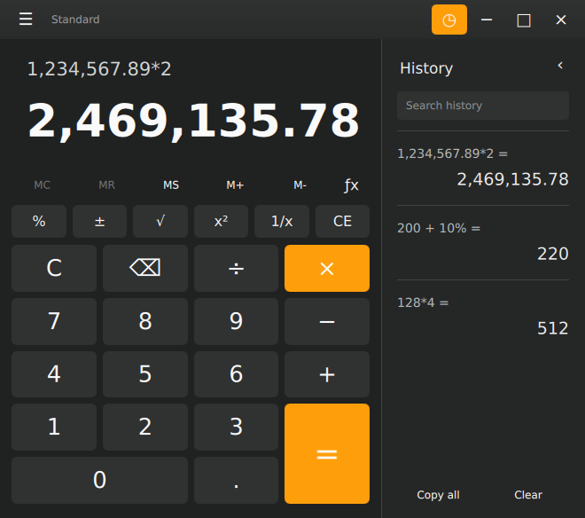
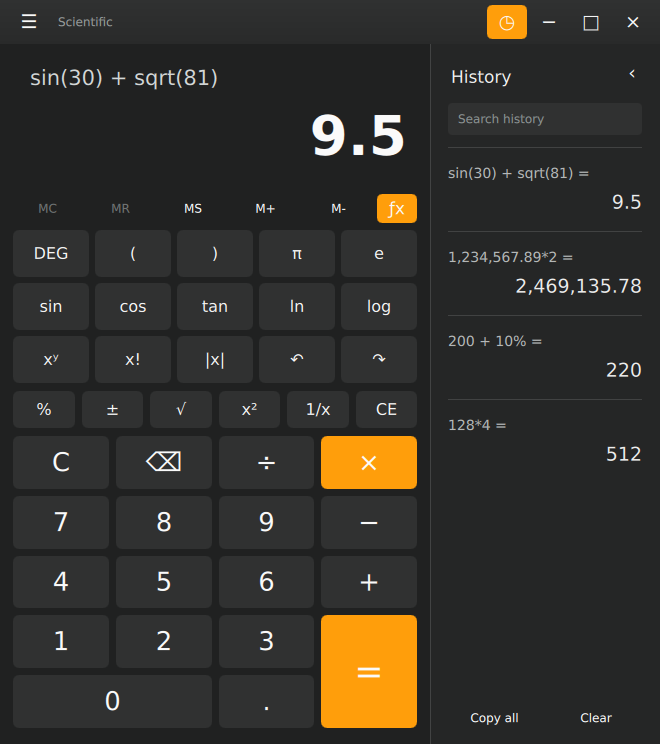
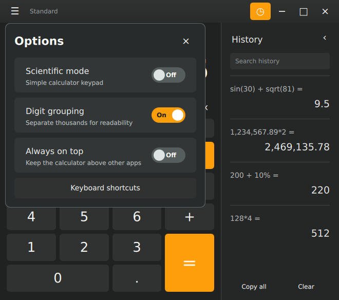

# Calc

A native Linux calculator built with Rust and Qt Quick/QML. Calculations run only when you press Enter or the equals button; editing keeps the last confirmed answer visible.

[Download v1.2.0](https://github.com/HappyCatKitten/Calc/releases/tag/v1.2.0) · [Test report](validation/REPORT.md)



## Features

- Simple charcoal interface with orange accents and optional history.
- Comma thousands grouping, editable expressions, parentheses, and normal precedence.
- Percentages, sign change, squares, roots, reciprocals, and repeated equals.
- Memory keys, undo/redo, clipboard shortcuts, and always-on-top.
- Switchable scientific keypad: powers, factorials, π/e, trig, logarithms, degrees/radians.
- Searchable saved history with reuse, copy, and individual deletion.


<details>
<summary>Scientific mode</summary>



</details>

<details>
<summary>Options</summary>



</details>

The screenshots above are captured from the running native app, not generated mockups.

## Install

Download the **amd64 `.deb`** or **Linux x86_64 `.tar.gz`** from [Releases](https://github.com/HappyCatKitten/Calc/releases). Qt 6.8.3 is bundled; the development SDK is not required.

Debian/Ubuntu/Pop!_OS:

```sh
sudo apt install ./calc_1.2.0_amd64.deb
```

Standalone archive / per-user installation:

```sh
tar -xzf calc-1.2.0-linux-x86_64.tar.gz
cd calc-1.2.0-linux-x86_64
./AppRun           # run without installing
./install.sh       # add to your app menu and ~/.local/bin
```

The archive installer uses `~/.local/share/calc/versions/1.2.0` (or `$XDG_DATA_HOME`) and needs no root access. Your saved history is kept separately. Verify downloads with the release's `SHA256SUMS`.

Built on Linux x86_64 with glibc 2.35. Tested on Pop!_OS 22.04/X11. The `.deb` declares its remaining system-library dependencies. Wayland plugins are bundled, but Wayland is not yet verified.

## Controls

| Shortcut | Action |
| --- | --- |
| P / M / D / T | Add / subtract / divide / multiply (keypad focus) |
| Enter / = | Calculate; repeat the operation |
| Ctrl+L | Edit expression |
| Ctrl+C / Ctrl+V | Copy result / paste expression |
| Ctrl+Z / Ctrl+Shift+Z | Undo / redo |
| Ctrl+H | Show/hide history |
| Ctrl+Shift+S | Scientific mode on/off |
| Escape | Clear calculation |
| Delete / Backspace | Clear entry / remove character |

The **☰** menu contains the scientific-mode switch, digit grouping, and always-on-top. Right-click a result or history entry for clipboard actions. Unary scientific keys act on the current operand: enter `30`, click `sin`, then press Enter.

`200 + 10%` gives `220`; `200 − 10%` gives `180`; `200 × 10%` gives `20`.

## Calculation engine

The native Rust expression parser supports precedence, parentheses, percentages, powers, factorials, and scientific functions. Arithmetic uses standard double-precision floating point, with domain and finite-result checks. Results are formatted to approximately 13 significant digits.

Typing, pasting, backspace, scientific-key edits, and history reuse prepare the expression without evaluating it. Enter or `=` calculates and records a result. Memory stores the last confirmed result.

## Build and test

Requirements: Rust/Cargo, Node.js, CMake, Ninja, C++17, and Qt 6.8+ with Qt Quick/Controls. Packaging additionally uses Python 3, `ldd`, `dpkg-query`, and `dpkg-deb` on Linux.

```sh
export QT_PREFIX=/path/to/Qt/6.8.3/gcc_64
./build.sh
./run.sh
cargo test --release --locked
node tests/format.test.mjs
python3 scripts/package.py
```

The package script creates the tarball, `.deb`, runtime manifest, licenses, and checksums in `dist/`. It refuses to overwrite an existing bundle. Native GUI checks can be run with `python3 scripts/screenshots.py` (Xvfb, xdotool, ImageMagick and xclip required).

See the [test report](validation/REPORT.md) for arithmetic, parser, deferred-evaluation and native UI coverage.

## Data and licensing

History: `$XDG_DATA_HOME/calc/history.json`, normally `~/.local/share/calc/history.json`. Preferences use Qt Settings under the HappyCatKitten organization. Existing Calc history and preferences are preserved.

Project code: [MIT](LICENSE). Bundled Qt/ICU and Rust dependencies retain their own licenses; see [third-party notices](THIRD_PARTY_NOTICES.md). Qt remains dynamically replaceable.
