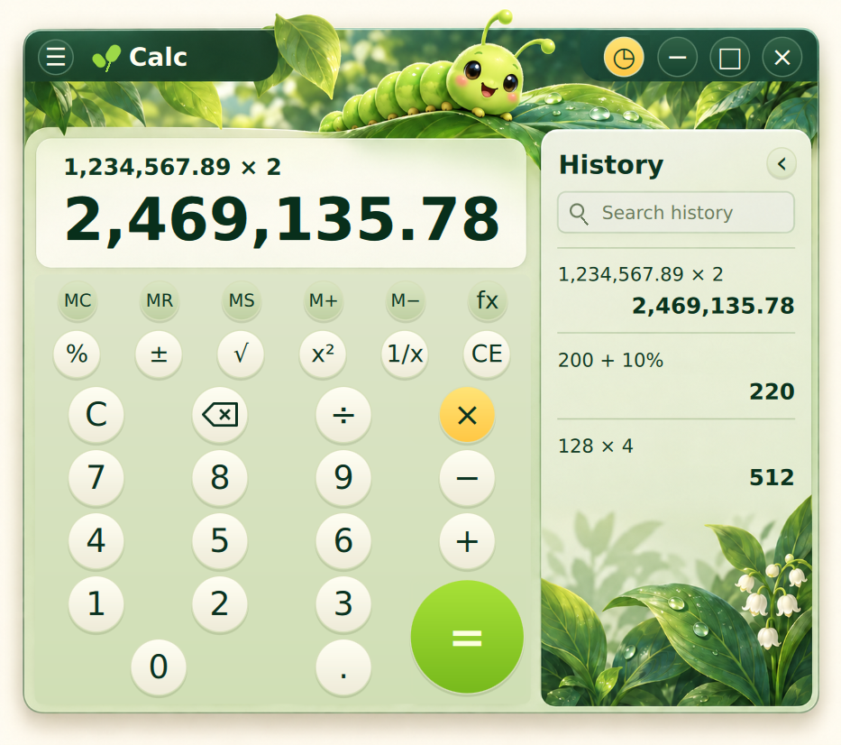

# Calc

A slick native Linux calculator whose arithmetic and scientific functions execute **actual Brainfuck programs**. The interface is Qt Quick/QML; Rust provides the expression parser, app state, and an optimizing Brainfuck interpreter.

[Download v1.1.0](https://github.com/HappyCatKitten/Calc/releases/tag/v1.1.0) · [Engine details](brainfuck/README.md) · [Test report](validation/REPORT.md)


## Features

- Simple charcoal interface with orange accents and optional history.
- Optional **Catacalc mode**: caterpillar artwork, circular keys, and a botanical history panel; enable it in Options.
- Comma thousands grouping, editable expressions, parentheses, and normal precedence.
- Percentages, sign change, squares, roots, reciprocals, and repeated equals.
- Memory keys, undo/redo, clipboard shortcuts, and always-on-top.
- Switchable scientific keypad: powers, factorials, π/e, trig, logarithms, degrees/radians.
- Searchable saved history with reuse, copy, and individual deletion.

<details open>
<summary>Catacalc mode (current source)</summary>



Calc 1.1.0 includes the Catacalc theme. Its preference persists between launches. Scientific mode and optional history work in both themes. In Catacalc, right-click the illustration below history to copy or clear all entries.

</details>

<details>
<summary>Scientific mode</summary>


</details>

<details>
<summary>Options</summary>


</details>

The screenshots above are captured from the running native app, not generated mockups. Catacalc uses generated artwork with live QML controls; see the [artwork notes](docs/catacalc-art.md).

## Install

Download the **amd64 `.deb`** or **Linux x86_64 `.tar.gz`** from [Releases](https://github.com/HappyCatKitten/Calc/releases). Qt 6.8.3 is bundled; the development SDK is not required.

Debian/Ubuntu/Pop!_OS:

```sh
sudo apt install ./calc_1.1.0_amd64.deb
```

Standalone archive / per-user installation:

```sh
tar -xzf calc-1.1.0-linux-x86_64.tar.gz
cd calc-1.1.0-linux-x86_64
./AppRun           # run without installing
./install.sh       # add to your app menu and ~/.local/bin
```

The archive installer uses `~/.local/share/calc/versions/1.1.0` (or `$XDG_DATA_HOME`) and needs no root access. Your saved history is kept separately. Verify downloads with the release's `SHA256SUMS`.

Built on Linux x86_64 with glibc 2.35. Tested on Pop!_OS 22.04/X11. The `.deb` declares its remaining system-library dependencies. Wayland plugins are bundled, but Wayland is not yet verified.

## Controls

| Shortcut | Action |
| --- | --- |
| Enter / = | Calculate; repeat the operation |
| Ctrl+L | Edit expression |
| Ctrl+C / Ctrl+V | Copy result / paste expression |
| Ctrl+Z / Ctrl+Shift+Z | Undo / redo |
| Ctrl+H | Show/hide history |
| Ctrl+Shift+S | Scientific mode on/off |
| Escape | Clear calculation |
| Delete / Backspace | Clear entry / remove character |

The **☰** menu contains Catacalc mode, the scientific-mode switch, digit grouping, and always-on-top. Right-click a result or history entry for clipboard actions. Unary scientific keys act on the current operand: enter `30`, then click `sin`.

`200 + 10%` gives `220`; `200 − 10%` gives `180`; `200 × 10%` gives `20`.

## Is the engine really Brainfuck?

Yes: sixteen `.bf` programs implement the numeric operations. [The macro assembler](brainfuck/generate.mjs) generates only Brainfuck instructions at build time. The Rust VM executes those programs; it does not dispatch to native calculator-math functions. Parsing, UI state, persistence and formatting remain native.

The dialect uses arbitrary-width nonnegative integer cells and 24 fractional decimal places. The wrapper still serializes f64 values and displays approximately 13 significant digits. There are execution/size limits and explicit errors for unsupported domains and precision loss; radian trig inputs above magnitude 10^12 are rejected. It is not an arbitrary-precision financial calculator. [Read the implementation and limitations](brainfuck/README.md).

## Build and test

Requirements: Rust/Cargo, Node.js, CMake, Ninja, C++17, and Qt 6.8+ with Qt Quick/Controls. Packaging additionally uses Python 3, `ldd`, `dpkg-query`, and `dpkg-deb` on Linux.

```sh
export QT_PREFIX=/path/to/Qt/6.8.3/gcc_64
./build.sh
./run.sh
cargo test --release --locked
node tests/format.test.mjs
python3 scripts/catacalc-smoke.py  # requires Xvfb, xdotool and ImageMagick
python3 scripts/package.py
```

The build regenerates the Brainfuck routines. The package script creates the tarball, `.deb`, runtime manifest, licenses, and checksums in `dist/`. It refuses to overwrite an existing bundle. You can also run the engine without Qt:

```sh
cargo run --release --bin bf-calc -- mul 128 4
cargo run --release --bin bf-calc -- sin 30
```

Validation covers **50 Rust test functions**, **48,234 counted campaign cases**, **15,000 randomized formatting assertions**, and native UI checks. Case counts and assertion counts overlap; they are not additive. See the [full report](validation/REPORT.md).

## Data and licensing

History: `$XDG_DATA_HOME/calc/history.json`, normally `~/.local/share/calc/history.json`. Preferences use Qt Settings under the HappyCatKitten organization. Calc imports history and preferences from Brainfuck Calculator or the earlier Obsidian Calculator when needed. Existing data is preserved.

Project code: [MIT](LICENSE). Bundled Qt/ICU and Rust dependencies retain their own licenses; see [third-party notices](THIRD_PARTY_NOTICES.md). Qt remains dynamically replaceable.
